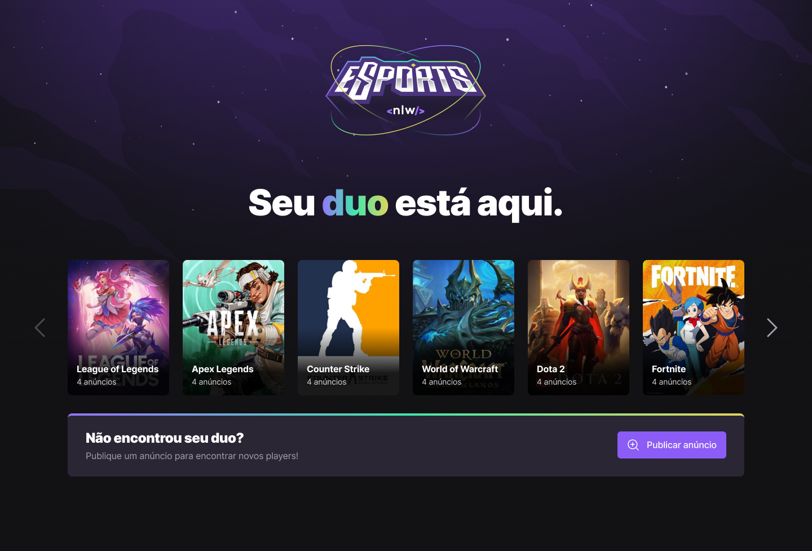

Projeto de um software web/mobile para encontrar duos em jogos.  Trilha Ignite da NLW e-Sports.

  

  <a href="#-tecnologias">Tecnologias</a>&nbsp;&nbsp;&nbsp;|&nbsp;&nbsp;&nbsp;
  <a href="#-layout">Layout</a>&nbsp;&nbsp;&nbsp;|&nbsp;&nbsp;&nbsp;
  <a href="#memo-licença">Licença</a>

# NLW - eSports

## 🚀 Tecnologias

### Front-end
- HTML
- CSS
- JavaScript
- TypeScript
- ReactJS
- TailwindCSS
- Radix UI

### Back-end
- NodeJS
- Express
- Prisma
- SQLite

### Mobile
- React Native
- Expo

## 🎨 Layout:

Figma: https://www.figma.com/file/fMH9LY1h1ngivGZBuq7zm5/NLW-eSports-(Community)?node-id=6%3A131

Feito com ♥ by VictorTrarbach